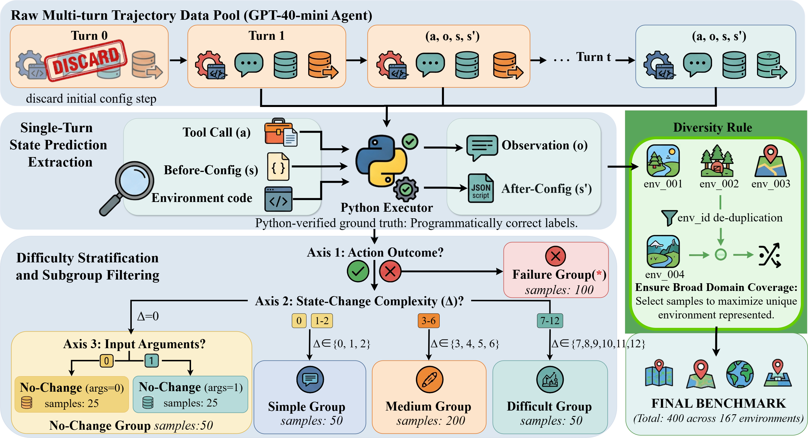

<!-- <div align="center">
  
</div> -->
<h1 align="center">EnvSimBench: A Benchmark for Evaluating and Improving LLM-Based Environment Simulation</h1>

<div align="center">
  <a href="https://arxiv.org/">
    
  </a>
  <a href="https://huggingface.co/datasets/Louie-CookieApril/EnvSimBench">
    
  </a>
  <a href="https://huggingface.co/Louie-CookieApril/EnvSimBench-Model">
    
  </a>
  <a href="https://www.python.org/downloads/">
    
  </a>
  <a href="LICENSE">
    
  </a>
</div>

<h5 align="center">If you find our work helpful, please give us a star ⭐ on GitHub. We greatly appreciate your support.</h5>

---

## 📑 Contents

- [👀 Overview](#-overview)
- [✨ Key Contributions](#-key-contributions)
- [📦 Dataset & Models](#-dataset--models)
- [📊 Main Results](#-main-results)
- [📁 Project Structure](#-project-structure)
- [🚀 Quick Start](#-quick-start)
- [🧪 Running the Benchmark](#-running-the-benchmark)
- [🏋️ Training Your Own Simulator](#-training-your-own-simulator)
- [📚 Citation](#-citation)
- [📞 Contact](#-contact)

---

## 👀 Overview

Scalable AI agent training relies on interactive environments that faithfully simulate the consequences of agent actions. Manually crafted environments are expensive to build, brittle to extend, and limited in diversity. A promising alternative is to replace executable environments with **LLM-simulated** counterparts — but this paradigm rests on an unexamined assumption:

> *Can LLMs accurately simulate environmental feedback?*

In practice, LLM simulators suffer from **hallucinations**, **logical inconsistencies**, and **silent state drift** — failures that corrupt agent reward signals and erode the cost advantage that motivated the paradigm.

**EnvSimBench** is the first rigorous benchmark designed to *evaluate the simulator itself*, rather than the agent. It introduces:

- A formal definition of **Environment Simulation Ability (EnvSim Ability)** as a measurable capability.
- A **constraint-driven MDP formulation** that decouples state estimation from transition reasoning, enabling LLM-free, programmatic evaluation.
- A specialized **4B simulation model** that surpasses frontier LLMs on Config Match while cutting synthesis costs by over 90%.

<p align="center">
  <br>
  <em>Overview of <b>EnvSimBench</b>: trajectory collection → three-axis stratification → frontier LLM evaluation + specialized small-model training.</em>
</p>

---

## ✨ Key Contributions

1. **Formalization.** We provide the first formal definition and operationalization of **Environment Simulation Ability** as a quantifiable research objective, framed as fully-observable state prediction over `(s_t, a_t, code(a_t)) → (ô_t, ŝ′_t)`.
2. **Benchmark.** We construct **EnvSimBench**: 400 samples drawn from **167 diverse environments**, equipped with verifiable programmatic labels and **three-axis difficulty stratification** (action outcome, state-change complexity, argument cardinality).
3. **Diagnosis.** Systematic evaluation of seven frontier LLMs reveals a universal **state-change cliff**: every model is near-perfect when state is invariant, yet collapses catastrophically once `|Δ| ≥ 3` simultaneous state updates are required.
4. **Optimization.** We design a **constraint-driven simulation pipeline** that, paired with a specialized 4B model, **reduces hallucination**, **boosts synthesis yield by 6.8%**, and **cuts simulation cost by over 90%**.

<p align="center">
  <br>
  <em>POMDP (left) vs. constraint-driven MDP (right). Supplying <code>s_t</code> and <code>code(a_t)</code> explicitly removes hallucination, enforces logical consistency, and prevents state drift by construction.</em>
</p>

---

## 📦 Dataset & Models

We release the EnvSimBench data and our trained simulation model (SFT + RL) on Hugging Face:

| Data | Description | Link |
| --- | --- | --- |
| Benchmark Metadata | 400 evaluation samples across 167 environments | [🤗 HuggingFace](https://huggingface.co/datasets/Louie-CookieApril/EnvSimBench/tree/main/Benchmark) |
| SFT Data | Supervised fine-tuning data for the simulator | [🤗 HuggingFace](https://huggingface.co/datasets/Louie-CookieApril/EnvSimBench/tree/main/SFT%20Data) |
| Process Data | Process / trajectory data used during construction | [🤗 HuggingFace](https://huggingface.co/datasets/Louie-CookieApril/EnvSimBench/tree/main/Process%20Data) |

| Model | Description | Link |
| --- | --- | --- |
| EnvSimBench-Model | 4B simulator (SFT + RL) — surpasses frontier LLMs on Config Match | [🤗 HuggingFace](https://huggingface.co/Louie-CookieApril/EnvSimBench-Model) |

### Benchmark Composition

| Group | Subgroup | Samples | Constraint |
| --- | --- | --- | --- |
| Failure | `O` returns error, `\|Δ\| = 0` | 20 | — |
| No-Change | `\|Δ\| = 0`, action succeeds | 80 | 40 per argument cardinality |
| Simple | `\|Δ\| ∈ {1, 2}` | 50 | 25 per `\|Δ\|` value |
| Medium | `\|Δ\| ∈ {3, …, 6}` | 200 | 50 per `\|Δ\|` value |
| Difficult | `\|Δ\| ∈ {7, …, 12}` | 50 | Distributed across `\|Δ\|` |

Each sample is **independently verifiable** against a deterministic external executor — no LLM-as-judge anywhere in the pipeline.

---

## 📊 Main Results

### Frontier LLMs Exhibit a Universal State-Change Cliff

| Model | Fail+No-Chg CM | State-Change CM | Overall CM |
| --- | :---: | :---: | :---: |
| DeepSeek-V3.2 | 100% | 10.0% | 32.5% |
| Qwen3.5-397B-A17B | 100% | 23.0% | 42.3% |
| GPT-5.4 | 100% | 22.7% | 42.0% |
| Gemini-3.1-Pro-Preview | 100% | 22.7% | 42.0% |
| Claude-Sonnet-4.6 | 99% | 17.3% | 37.8% |
| MiniMax-M2.7 | 99% | 22.7% | 41.8% |
| GLM-5 | 100% | 21.3% | 41.0% |
| **Ours (Full-Balance2, 4B)** | **100%** | **—** | **45.3%** |

- Every frontier model achieves ≥99% CM on state-preserving samples but collapses on state-changing ones.
- At `|Δ| ≥ 5`, all frontier models converge near zero CM.
- Our **4B specialized simulator surpasses all frontier LLMs on Config Match** while running at ≈59× lower parameter count.

<p align="center">
  <br>
  <em>Config Match vs. <code>|Δ|</code>. Frontier LLMs (thin lines) drop sharply at <code>|Δ| ≥ 3</code>; our Full-Balance2 (thick) leads by up to +10 pp on the deployable regime.</em>
</p>

### Downstream Synthesis Yield

Plugging our 4B simulator into the EnvScaler synthesis pipeline (replacing its large-model ensemble) yields:

- **+6.8%** more environments passing the 0.85 quality threshold (191 → 204)
- **>90%** lower simulation cost
- Pareto-superior on both cost and quality

---

## 📁 Project Structure

```
EnvSimBench/
├── Benchmark/                 # 400 evaluation samples + executor labels
├── Construction/              # Trajectory collection & three-axis stratification pipeline
├── Evaluation/                # Frontier LLM evaluation harness (FM / CM metrics)
├── EnvScaler/                 # Downstream synthesis-pipeline integration (SFT data prep)
├── Figs/                      # Figures used in the paper / README
└── requirements.txt
```

> 💡 Each subdirectory ships its own `README.md` with detailed usage instructions.

---

## 🚀 Quick Start

### 1. Clone the repository

```bash
git clone https://github.com/cookieApril/EnvSimBench
cd EnvSimBench
```

### 2. Install dependencies

```bash
pip install -r requirements.txt
```

> Training relies on **[LLaMA-Factory](https://github.com/hiyouga/LLaMA-Factory)**. Please follow its official installation guide to set up `llamafactory-cli` and the matching `vllm` runtime before running the training/serving scripts below.

### 3. Configure your LLM service

#### Option A — Use a hosted API

```bash
# .env
OPENAI_API_KEY=your-api-key
OPENAI_BASE_URL=https://api.openai.com/v1
```

#### Option B — Self-host the EnvSimBench-Model with LLaMA-Factory + vLLM

```bash
DISABLE_VERSION_CHECK=1 llamafactory-cli api \
  --model_name_or_path saves/qwen3-4b-Base-noreasoning-selectedByTaskid-Change-balance2 \
  --template qwen \
  --infer_backend vllm \
  --vllm_maxlen 16384 \
  --vllm_gpu_util 0.9 \
  --vllm_enforce_eager \
  --no_enable_thinking
```

The service exposes an OpenAI-compatible `/v1/chat/completions` endpoint. To call it from another machine, point `OPENAI_BASE_URL` at the GPU node's IP (find it via `ip a` → `bond0`):

```bash
export OPENAI_API_KEY="dummy"
export OPENAI_BASE_URL="http://<GPU_NODE_IP>:8013/v1"
export PORT=8013
```

A quick sanity check:

```bash
python -c "
import requests
resp = requests.post(
    f'{__import__(\"os\").environ[\"OPENAI_BASE_URL\"]}/chat/completions',
    json={
        'model': 'models/Qwen/Qwen3-4B-Base',
        'messages': [{'role': 'user', 'content': '你好，请介绍一下你自己。'}],
        'max_tokens': 100,
    },
)
print(resp.json()['choices'][0]['message']['content'])
"
```

### 4. Download the benchmark

```bash
huggingface-cli download Louie-CookieApril/EnvSimBench \
    --repo-type dataset --local-dir ./data
```

---

## 🧪 Running the Benchmark

Evaluate any model under the constraint-driven MDP formulation using the script in `Evaluation/`:

```bash
cd Evaluation
python evaluate.py \
  --input ./eval/9.choice_final_combined-167env.json \
  --model qwen3_4B \
  --max_samples 400 \
  --max_workers 3
```

Arguments:

| Flag | Description |
| --- | --- |
| `--input` | Path to the benchmark JSON (e.g. `9.choice_final_combined-167env.json`, 400 samples / 167 envs). |
| `--model` | Model identifier — either a hosted API name (`gpt-4o`, `deepseek-v3.2`, …) or a local key like `qwen3_4B` that maps to your self-hosted endpoint. |
| `--max_samples` | Cap on samples to evaluate (use `400` for the full benchmark). |
| `--max_workers` | Concurrency for inference requests. |

Each prompt instantiates `(s_t, a_t, code(a_t))` and is scored by two **binary, programmatic** metrics:

- **Feedback Match (FM)** — exact equality between predicted observation `ô_t` and ground-truth `o_t`.
- **Config Match (CM)** — whether predicted Δ-operations, applied to `s_t`, reproduce `s′_t` exactly. CM is invariant to output-format conventions and is the primary cross-model reasoning metric.

Per-axis breakdowns (Failure / No-Change / Simple / Medium / Difficult, plus per-`|Δ|` slices) are written next to the input JSON.

---

## 🏋️ Training Your Own Simulator

We release the SFT data and the **Balance2** mixture used to train our 4B model. Training is implemented on top of **LLaMA-Factory** with full-parameter SFT + DeepSpeed ZeRO-3 on 2× A800 (80 GB) GPUs.

### 1. Fetch the SFT data

```bash
huggingface-cli download Louie-CookieApril/EnvSimBench \
    --repo-type dataset --local-dir ./data
```

Register the dataset in your LLaMA-Factory `data/dataset_info.json` under the key `13.SFT-data-noreasoning-selectedByTaskid-Change-balance2`.

### 2. Run full-parameter SFT

```bash
# NCCL / multi-GPU setup
export NCCL_P2P_DISABLE=1
export NCCL_IB_DISABLE=1   # disable if no IB NIC
export CUDA_VISIBLE_DEVICES=0,1

FORCE_TORCHRUN=1 NPROC_PER_NODE=2 DISABLE_VERSION_CHECK=1 llamafactory-cli train \
  --model_name_or_path models/Qwen/Qwen3-4B-Base \
  --template qwen \
  --dataset 13.SFT-data-noreasoning-selectedByTaskid-Change-balance2 \
  --dataset_dir data \
  --finetuning_type full \
  --output_dir saves/qwen3-4b-Base-noreasoning-selectedByTaskid-Change-balance2 \
  --per_device_train_batch_size 1 \
  --gradient_accumulation_steps 16 \
  --learning_rate 2e-5 \
  --num_train_epochs 3 \
  --bf16 \
  --overwrite_output_dir \
  --ddp_find_unused_parameters false \
  --cutoff_len 8192 \
  --do_train \
  --save_strategy steps \
  --save_steps 200 \
  --save_total_limit 3 \
  --ddp_timeout 18000 \
  --flash_attn fa2 \
  --gradient_checkpointing true \
  --lr_scheduler_type cosine \
  --warmup_ratio 0.05 \
  --logging_steps 10 \
  --deepspeed ds_z3_config.json
```

### 3. Serve the trained checkpoint

```bash
DISABLE_VERSION_CHECK=1 llamafactory-cli api \
  --model_name_or_path saves/qwen3-4b-Base-noreasoning-selectedByTaskid-Change-balance2 \
  --template qwen \
  --infer_backend vllm \
  --vllm_maxlen 16384 \
  --vllm_gpu_util 0.9 \
  --vllm_enforce_eager \
  --no_enable_thinking
```

### 4. Evaluate

```bash
cd Evaluation
python evaluate.py \
  --input ./eval/9.choice_final_combined-167env.json \
  --model qwen3_4B \
  --max_samples 400 \
  --max_workers 3
```

> **Composition matters more than volume.** Mirroring the empirical `|Δ|` distribution of source environments (1 K failure + 1 K no-change + 2 K simple-change + 2.23 K complex-change ≈ 6.23 K total) outperforms naïve scaling at the 5 K-sample regime.

---

## 📚 Citation

If you find our work helpful, please consider citing it. We greatly appreciate your support.

```bibtex
@article{liu2025envsimbench,
  title   = {EnvSimBench: A Benchmark for Evaluating and Improving LLM-Based Environment Simulation},
  author  = {Liu, Yi and Hui, TingFeng and Zhang, Wei and Sun, Li and Su, Ningxin and Wang, Jian and Su, Sen},
  journal = {arXiv preprint},
  year    = {2025}
}
```

---

## 📞 Contact

For questions, suggestions, or collaboration, please reach out to:

- **Yi Liu** — [louie@bupt.edu.cn](mailto:louie@bupt.edu.cn)
- Open an issue on this repository.
