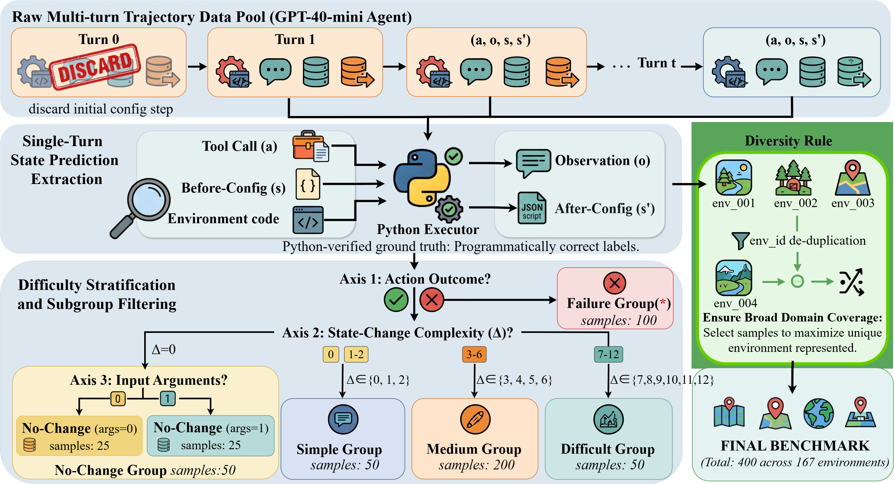
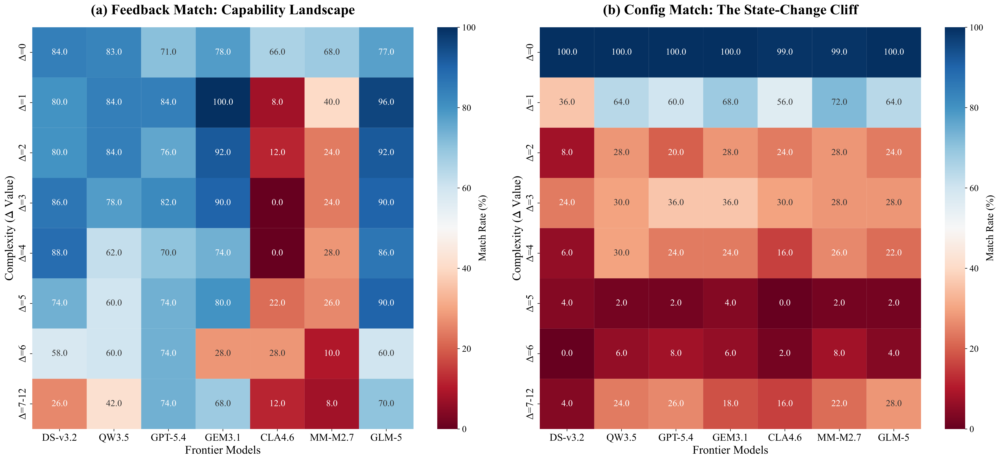

<h1 align="center">EnvSimBench</h1>
<h3 align="center">A Benchmark for Evaluating and Improving LLM-Based Environment Simulation</h3>

<p align="center">
  <a href="https://arxiv.org/abs/2605.07247v1"></a>
  <a href="https://huggingface.co/datasets/Louie-CookieApril/EnvSimBench"></a>
  <a href="https://huggingface.co/Louie-CookieApril/EnvSimBench-Model"></a>
  <a href="https://www.python.org/downloads/"></a>
  <a href="LICENSE"></a>
</p>

<p align="center">
  <a href="README.md">English</a> | <a href="README_ZH.md">中文</a>
</p>

<p align="center"><b>Can an LLM faithfully simulate what an environment would do next?</b></p>

<p align="center">
  
</p>
<p align="center">
  <em>EnvSimBench converts multi-turn trajectories into executor-verified state-prediction samples, diagnoses frontier LLMs, and trains a specialized 4B simulator for reliable, low-cost environment synthesis.</em>
</p>

EnvSimBench evaluates the simulator rather than the agent. Given the current environment state, a tool call, and the tool implementation, a model must predict both the user-visible feedback and the exact state transition. The benchmark exposes a consistent weakness across frontier LLMs: models often generate plausible feedback while silently producing an incorrect next state.

> If you find this project useful, please consider giving it a star ⭐ and citing our paper.

---

## Contents

- [Why EnvSimBench?](#why-envsimbench)
- [Task formulation](#task-formulation)
- [Benchmark construction](#benchmark-construction)
- [Main results](#main-results)
- [Released resources](#released-resources)
- [Quick start](#quick-start)
- [Run the benchmark](#run-the-benchmark)
- [Train a simulator](#train-a-simulator)
- [Repository layout](#repository-layout)
- [Citation](#citation)

## Why EnvSimBench?

LLM-simulated environments can make agent training cheaper and easier to scale, but only if their feedback and state updates faithfully reflect each action. In practice, three failure modes make this assumption fragile:

- **Hallucination:** the simulator invents a plausible but incorrect transition.
- **Logical inconsistency:** fields within one response contradict each other.
- **State drift:** earlier updates are silently forgotten across turns.

EnvSimBench turns environment simulation into an independently verifiable prediction problem and contributes:

1. **A measurable capability.** We formalize **Environment Simulation Ability (EnvSim Ability)** as the ability to predict an action's observation and resulting state.
2. **An executor-verified benchmark.** The release contains **400 samples from 167 tool-interactive environments**, stratified along three difficulty axes and labeled by deterministic Python execution.
3. **A diagnostic finding.** Seven frontier LLMs exhibit a pronounced **state-change cliff**: configuration accuracy drops sharply once an action must update several fields.
4. **A practical remedy.** A constraint-driven 4B simulator reaches **45.3% overall Config Match**, outperforming all evaluated frontier baselines, while increasing downstream synthesis yield by **6.8%** and reducing construction cost by **over 90%**.

## Task formulation

Standard LLM simulators infer the environment state from interaction history, mixing two sources of error: state reconstruction and transition prediction. EnvSimBench isolates transition fidelity by explicitly providing the current state and tool logic.

For each sample, the model receives:

```text
(before-state s_t, tool call a_t, tool implementation code(a_t))
```

and predicts:

```text
(feedback o_hat_t, state-change operations Delta_hat_t)
```

The evaluator applies the predicted operations to `s_t` and compares the reconstructed state with the executor-produced state `s'_t`.

<p align="center">
  
</p>
<p align="center">
  <em>Left: history-conditioned simulation requires implicit state tracking. Right: the constraint-driven formulation supplies the full state and tool implementation, making every transition independently verifiable.</em>
</p>

### Metrics

- **Feedback Match (FM):** exact match between predicted and reference feedback.
- **Config Match (CM):** whether the predicted changes reconstruct the exact reference after-state. CM is the primary metric for transition reasoning because it is robust to superficial response-format differences.

FM and CM are complementary: correct-looking feedback does not guarantee a correct state update, and a correct state update does not guarantee an exact feedback-string match.

## Benchmark construction

EnvSimBench starts from multi-turn trajectories collected by a GPT-4o-mini agent in 191 EnvScaler environments. Each valid transition is converted into a self-contained sample and replayed through the environment code to obtain programmatically verified ground truth.

Samples are stratified along three axes:

1. **Action outcome:** success or failure.
2. **State-change complexity:** the number of changed fields, `|Delta|`.
3. **Argument cardinality:** zero versus one-or-more input arguments for state-preserving cases.

A diversity rule maximizes unique environment coverage within each stratum, producing the final benchmark of **400 samples across 167 environments**.

<p align="center">
  
</p>
<p align="center">
  <em>Trajectory extraction, Python-verified labeling, three-axis stratification, and diversity-aware sampling.</em>
</p>

| Group | Definition | Samples | Sampling constraint |
| --- | --- | ---: | --- |
| Failure | Action returns an error and `|Delta| = 0` | 20 | State must remain unchanged |
| No-Change | Action succeeds and `|Delta| = 0` | 80 | 40 per argument-cardinality subgroup |
| Simple | `|Delta| in {1, 2}` | 50 | 25 per change count |
| Medium | `|Delta| in {3, ..., 6}` | 200 | 50 per change count |
| Difficult | `|Delta| in {7, ..., 12}` | 50 | Distributed across change counts |

## Main results

<p align="center">
  
</p>
<p align="center">
  <em>Feedback Match (blue) and Config Match (orange) for seven frontier LLMs under non-thinking inference. State-preserving samples are easy, while state-changing groups reveal a large and persistent FM-CM gap.</em>
</p>

### Frontier LLMs hit a state-change cliff

- State-preserving CM is **99-100%** across all evaluated models.
- Simple-group CM ranges from **22% to 50%**.
- Medium-group CM falls to **8.5-17.5%**.
- Difficult-group CM remains low at **4-28%** and is non-monotonic because some high-change samples contain repetitive, bulk-uniform updates.
- At `|Delta| = 5`, every evaluated frontier model scores **4% CM or lower**.

The central failure is not merely poor feedback generation. Models can return believable, even exactly matching feedback while corrupting the hidden environment state - a particularly risky error for agent-training pipelines.

### Overall frontier-model performance

| Model | Fail + No-Change CM | State-Change CM | Overall FM | Overall CM |
| --- | ---: | ---: | ---: | ---: |
| DeepSeek-V3.2 | 100.0% | 10.0% | 72.5% | 32.5% |
| Qwen3.5-397B-A17B | 100.0% | **23.0%** | 69.0% | **42.3%** |
| GPT-5.4 | 100.0% | 22.7% | 74.5% | 42.0% |
| Gemini-3.1-Pro-Preview | 100.0% | 22.7% | 74.0% | 42.0% |
| Claude-Sonnet-4.6 | 99.0% | 17.3% | 25.5% | 37.8% |
| MiniMax-M2.7 | 99.0% | 22.7% | 33.0% | 41.8% |
| GLM-5 | 100.0% | 21.3% | **80.5%** | 41.0% |

### A specialized 4B simulator beats frontier baselines

Training data composition matters more than naive volume scaling. **Full-Balance2** mirrors the source distribution with 1,000 failure, 1,000 no-change, 2,000 simple-change, and 2,230 complex-change samples. It achieves:

- **45.3% overall CM**, +3.0 percentage points over the best frontier baseline.
- **79.5% overall FM**, within 1.0 point of the strongest frontier FM result.
- Up to **+10 points CM** over the strongest frontier baseline for `|Delta| in {1, 2, 3, 4}`.

<p align="center">
  
</p>
<p align="center">
  <em>Full-Balance2 leads in the practically deployable low-to-medium change regime; all approaches remain challenged when five or more fields must change.</em>
</p>

### Downstream validation

Replacing EnvScaler's large-model ensemble with Full-Balance2 increases the number of environments passing the 0.85 quality threshold from **191 to 204**:

- **+6.8%** synthesis yield
- **more than 90%** lower construction cost
- approximately **59x** fewer model parameters

<details>
<summary><b>Expanded per-change-count heatmaps</b></summary>

<br>
<p align="center">
  
</p>

The heatmaps make the state-change cliff explicit: CM is 99-100% at `|Delta| = 0` but falls to 0-4% at `|Delta| = 5`. They also show that high feedback accuracy can coexist with very low configuration accuracy.

</details>

## Released resources

### Data

| Resource | Description | Link |
| --- | --- | --- |
| Benchmark | 400 executor-verified evaluation samples across 167 environments | [Hugging Face](https://huggingface.co/datasets/Louie-CookieApril/EnvSimBench/tree/main/Benchmark) |
| SFT Data | Supervised fine-tuning data for simulator specialization | [Hugging Face](https://huggingface.co/datasets/Louie-CookieApril/EnvSimBench/tree/main/SFT%20Data) |
| Process Data | Construction trajectories and intermediate process data | [Hugging Face](https://huggingface.co/datasets/Louie-CookieApril/EnvSimBench/tree/main/Process%20Data) |

### Model

| Resource | Description | Link |
| --- | --- | --- |
| EnvSimBench-Model | Specialized 4B simulator trained with SFT and RL | [Hugging Face](https://huggingface.co/Louie-CookieApril/EnvSimBench-Model) |

## Quick start

### 1. Clone and install

```bash
git clone https://github.com/cookieApril/EnvSimBench.git
cd EnvSimBench
pip install -r requirements.txt
```

Training and local serving use [LLaMA-Factory](https://github.com/hiyouga/LLaMA-Factory). Install a compatible LLaMA-Factory and vLLM environment before running the training or serving commands below.

### 2. Download the released data

```bash
huggingface-cli download Louie-CookieApril/EnvSimBench \
  --repo-type dataset \
  --local-dir ./data
```

### 3. Configure an inference endpoint

For a hosted OpenAI-compatible API:

```bash
export OPENAI_API_KEY="your-api-key"
export OPENAI_BASE_URL="https://api.openai.com/v1"
```

To serve the released checkpoint locally with LLaMA-Factory and vLLM:

```bash
DISABLE_VERSION_CHECK=1 llamafactory-cli api \
  --model_name_or_path saves/qwen3-4b-Base-noreasoning-selectedByTaskid-Change-balance2 \
  --template qwen \
  --infer_backend vllm \
  --vllm_maxlen 16384 \
  --vllm_gpu_util 0.9 \
  --vllm_enforce_eager \
  --no_enable_thinking
```

The server exposes an OpenAI-compatible `/v1/chat/completions` endpoint.

## Run the benchmark

```bash
cd Evaluation
python evaluate.py \
  --input ./eval/9.choice_final_combined-167env.json \
  --model qwen3_4B \
  --max_samples 400 \
  --max_workers 3
```

| Argument | Description |
| --- | --- |
| `--input` | Benchmark JSON path. The released benchmark contains 400 samples from 167 environments. |
| `--model` | Hosted model name or local endpoint key. |
| `--max_samples` | Number of samples to evaluate; use `400` for the full benchmark. |
| `--max_workers` | Number of concurrent inference requests. |

The evaluator reports FM and CM overall, by difficulty group, and by state-change count.

## Train a simulator

Register the Balance2 dataset in LLaMA-Factory's `data/dataset_info.json`, then run full-parameter SFT:

```bash
export NCCL_P2P_DISABLE=1
export NCCL_IB_DISABLE=1
export CUDA_VISIBLE_DEVICES=0,1

FORCE_TORCHRUN=1 NPROC_PER_NODE=2 DISABLE_VERSION_CHECK=1 \
llamafactory-cli train \
  --model_name_or_path models/Qwen/Qwen3-4B-Base \
  --template qwen \
  --dataset 13.SFT-data-noreasoning-selectedByTaskid-Change-balance2 \
  --dataset_dir data \
  --finetuning_type full \
  --output_dir saves/qwen3-4b-Base-noreasoning-selectedByTaskid-Change-balance2 \
  --per_device_train_batch_size 1 \
  --gradient_accumulation_steps 16 \
  --learning_rate 2e-5 \
  --num_train_epochs 3 \
  --bf16 \
  --cutoff_len 8192 \
  --do_train \
  --save_strategy steps \
  --save_steps 200 \
  --save_total_limit 3 \
  --flash_attn fa2 \
  --gradient_checkpointing true \
  --lr_scheduler_type cosine \
  --warmup_ratio 0.05 \
  --logging_steps 10 \
  --deepspeed ds_z3_config.json \
  --ddp_find_unused_parameters false \
  --ddp_timeout 18000 \
  --overwrite_output_dir
```

The paper uses full-parameter SFT on 2x A800 80 GB GPUs. Adjust distributed-training and memory settings for your hardware.

## Repository layout

```text
EnvSimBench/
├── Benchmark/       # Evaluation samples and executor-produced labels
├── Construction/    # Trajectory extraction and stratified sampling
├── Evaluation/      # Model inference and FM/CM evaluation
├── EnvScaler/       # Downstream synthesis-pipeline integration
├── Figs/            # Paper and README figures
└── requirements.txt
```

Each major subdirectory contains a dedicated README with component-specific instructions.

## Citation

```bibtex
@article{liu2026envsimbench,
  title   = {EnvSimBench: A Benchmark for Evaluating and Improving LLM-Based Environment Simulation},
  author  = {Liu, Yi and Hui, TingFeng and Zhang, Wei and Sun, Li and Su, Ningxin and Wang, Jian and Su, Sen},
  journal = {arXiv preprint arXiv:2605.07247},
  year    = {2026}
}
```

## Contact

For questions, suggestions, or collaboration:

- **Yi Liu:** [louie@bupt.edu.cn](mailto:louie@bupt.edu.cn)
- Open an issue in this repository.
